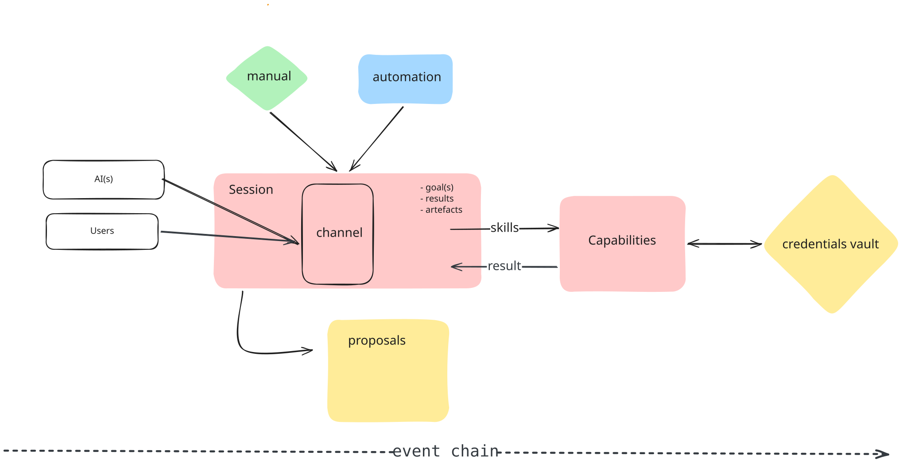

# Synap

**The backend where the user is the center — not the app.**

A configuration-first, self-hostable backend for the next generation of software:
one sovereign data pod per user, and every app builds on top of it.

[Website](https://www.synap.live) · [Docs](https://www.synap.live/docs) · [Discord](https://discord.gg/synap) · [Hosted](https://www.synap.live/hosted)

[License: MIT](./LICENSE)
[Deploy](#self-host)
[Discord](https://discord.gg/synap)

---

## Why Synap exists

For twenty years, the web has been organized around **apps that own their users' data**. You sign up for one SaaS after another, and your identity, your knowledge, your history end up shattered across a hundred silos you don't control.

Synap flips that model.

The **user** is the sovereign root. They own **one data pod** — a typed, permissioned,
auditable space that holds their entities, their history, and their credentials.
**Apps plug into the pod**, not the other way around. Any app can read (with consent),
any app can write (with review), and everything the user does anywhere in the ecosystem
converges back into a single graph they actually own.

That's the mission: **a web where users are centralized and applications orbit them.**

Synap is the backend that makes it possible.

---

## What Synap is, in one sentence

> A configuration-first backend that ships with entities, relations, views, workflows,
> automations, capabilities, credentials, real-time collaboration, an event-sourced
> history and an AI-proposal governance layer out of the box — so builders (and their
> agents) never have to write, secure, or maintain a backend again.

If you know Supabase: think of Synap as a spiritual successor built for the AI era,
where the pod is user-owned, agents are first-class, and every capability is a
configuration you can generate, not code you have to ship.

---

## The one flow that shows it all



1. A user asks their **AI agent** to schedule a meeting with a new contact.
2. The agent generates a **proposal** — a structured change with a diff (`create person`, `create event`, `link event → person`).
3. The user sees the proposal in the **glass-box governance seat** and approves it.
4. The backend creates the **entities**; a **view** (kanban, calendar, table, bento…) instantly reflects them.
5. An **automation** watches the change and fires a **workflow** — "when an event is created with a new person, send them a confirmation email."
6. The workflow calls a **capability** — `google.calendar.createEvent` — using **credentials stored once in the pod**, never handed to the agent.
7. The whole run is captured in the **event log**, replayable, and saved as a **playbook** the user can rerun anytime.

One flow. Every core primitive. Zero backend code written.

---

## The data model: five nouns and a governance layer

Synap is deliberately small at its core. Almost everything you build is a
composition of five primitives.

> _[Diagram placeholder — the five nouns as a stack]_
> `docs/assets/five-noun-model.svg`

| Noun           | What it is                                                                                                            | Example                                              |
| -------------- | --------------------------------------------------------------------------------------------------------------------- | ---------------------------------------------------- |
| **Atom**       | The smallest indivisible unit — a typed cell of data (string, number, reference, rich text…).                         | `title: "Ship v1"`                                   |
| **Entity**     | A typed record composed of atoms, validated against a profile schema.                                                 | A `task`, a `person`, a `deal`                       |
| **View**       | A rendering of a query over entities — 16 types available (table, kanban, calendar, bento, graph, flow, whiteboard…). | A kanban of tasks by status                          |
| **Workspace**  | A bounded lens over entities and views — a **workspace is an app**.                                                   | "CRM", "Content OS", "Home"                          |
| **Automation** | Event- or schedule-triggered flow that runs a DAG of nodes to react to or produce change.                             | "When a deal reaches Won, create an onboarding task" |

Layered on top of the five nouns:

- **Proposals** — every AI (and optionally every human) mutation is a reviewable proposal. Approve, reject, or edit before it hits the graph.
- **Capabilities** — reusable actions (call an API, send an email, hit Google Workspace, run a script) generated from configuration. Credentials are stored once in the pod and never leak to the agent that uses them.
- **Playbooks** — saved, replayable templates of workflows. A workflow you ran once becomes a workflow anyone can rerun with new inputs.
- **Relations & the knowledge graph** — typed, directional edges between entities, with BFS traversal, structural links, and semantic edges coexisting.
- **Event sourcing** — every change is an append-only event (`{subject}.{action}.{phase}`), stored in a TimescaleDB hypertable with full causation chains.

That's it. Everything else — CRM, task manager, content studio, custom internal tool
— is a **workspace** built from those primitives.

---

## What you get out of the box

- 🧠 **Typed knowledge graph** — polymorphic relations, BFS traversal, structural + semantic edges
- 🎨 **16 view types** — table, kanban, calendar, gallery, matrix, masonry, flow, bento dashboards, whiteboard, and more
- 🤖 **AI-native, agent-first** — 13 supported AI surfaces, BYO-agent, MCP tools, agent-owned workspaces
- 🛡 **Glass-box governance** — every AI write is a proposal, reviewable and revertible
- ⚡ **Automations** — 12 node types, event/cron/webhook/manual triggers, flow DAG
- 🔌 **39+ connectors** — Google, GitHub, Notion, Linear, Slack, HubSpot… via Nango
- 🔐 **Enterprise-grade auth** — Ory Kratos + Hydra, ES256 JWT, RBAC 9-step ladder
- 🔎 **Semantic + full-text search** — Typesense + pgvector
- 🗂 **Multi-workspace** — workspaces as lenses over one graph, not silos
- 📼 **Event-sourced history** — append-only, replayable, causally chained
- 🧩 **Capabilities & credential vault** — one place for keys, code generated from config
- 🔁 **Playbooks** — turn any workflow into a reusable template
- 🖥 **Real-time collaboration** — Socket.IO + Yjs
- 📦 **~55 tables, 21+ Hub sub-routers, 27+ background workers** — production-ready

---

## Two ways to run Synap

### ☁️ Hosted (recommended to try)

One click. One payment. We host and maintain your pod, keep it secure, upgrade it,
and back it up. You keep sovereignty via export any time.

**→ [Get a hosted pod](https://www.synap.live/hosted)** _(from €X/month)_

Best for: individuals, indie builders, teams who want the vision without the ops.

### 🖥 Self-hosted (open source)

Run the entire stack on your own Linux server via Docker. You own the box, the data,
and the upgrade schedule. MIT licensed. No feature gating.

**→ [Deploy the self-hosted stack](./docs/deploy/self-hosted.md)**

Best for: privacy-first users, homelabbers, agencies, enterprises with residency needs.

|                | Hosted        | Self-hosted  |
| -------------- | ------------- | ------------ |
| Setup time     | < 2 min       | ~15 min      |
| Cost           | Subscription  | Your infra   |
| Upgrades       | Automatic     | You run them |
| Data location  | Our EU region | Your machine |
| Feature parity | 100%          | 100%         |
| Support        | Included      | Community    |

---

## Quickstart (self-hosted)

**Prerequisites:** Linux server, Docker, 2 vCPU / 4 GB RAM minimum, a domain.

```bash
# 1. Clone
git clone https://github.com/Synap-core/backend.git synap && cd synap

# 2. Configure
cp .env.example .env
# → edit .env: DOMAIN, admin credentials, provider keys

# 3. Deploy
./eve up

# 4. Verify
./eve status
That's it. Your pod is live at ⁠https://your-domain, with SSL, admin UI, and the
Hub API ready. Full walkthrough: docs/deploy/self-hosted.md.
Connect your first AI surface:
synap connect claude          # or: cursor, chatgpt, raycast, ...
synap orient                  # see your pod at a glance
Architecture at a glance
[Diagram placeholder — high-level architecture]
⁠docs/assets/architecture.svg
Browser / Desktop / CLI / MCP / Raycast / Discord / Mobile
                        │
                        ▼
              ┌─────────────────────┐
              │  Control Plane API  │  ← auth, billing, provisioning, marketplace
              └──────────┬──────────┘
                         │  ES256 JWT
        ┌────────────────┼─────────────────┐
        ▼                ▼                 ▼
   Synap Apps    Intelligence Service   Data Pod (Backend)
   (workspaces)  (LangGraph + agents)   PostgreSQL + Timescale
                                        Typesense + pgvector
                                        27+ pg-boss workers
                                        Socket.IO + Yjs
Deep dive: docs/architecture.md — event flow, storage,
proposal pipeline, capability system, and the full Hub Protocol.
Documentation
	•	📘 Getting Started — install, first workspace, first AI connection	•	🧱 The Five-Noun Model — Atom, Entity, View, Workspace, Automation	•	🛡 Proposals & Governance — how AI writes stay safe	•	🧩 Capabilities — configuration-first actions with stored credentials	•	🔁 Automations & Playbooks — triggers, DAG nodes, templates	•	🎨 Views & Bento — the 16 view types and dashboard composition	•	🔌 Connectors — Nango providers and sync	•	🧑‍💻 CLI Reference — every ⁠synap command	•	🌐 Hub Protocol — the REST/tRPC API surface	•	🚀 Deployment — hosted, self-hosted, upgrades, backups
Community
Synap is more than a product — it's a movement toward a user-centric web.
	•	💬 Discord — daily conversations, share workspaces, get help	•	📰 Substack — vision essays, release notes, deep dives	•	🐦 @synap on X — build-in-public, launches, demos	•	🧪 Playbook & Template Marketplace (soon) — user-built apps on top of Synap
If the vision resonates, join the Discord and say hi.
The best way to shape where this goes is to be there while it's small.
Contributing
Synap is MIT-licensed and built in the open. Issues, discussions, and PRs welcome.
	•	Read CONTRIBUTING.md	•	Look at good first issues	•	Or just open a discussion — questions are contributions too
Roadmap highlights
	☑︎	Sovereign pod + BYO-agent (V0)	☑︎	Proposal governance + agent-owned workspaces	☑︎	16 view types + bento dashboards	☑︎	39+ connectors via Nango	☑︎	Capability system + credential vault	☐	Template & playbook marketplace (in progress)	☐	Python SDK	☐	Public LoCoMo benchmarks	☐	Web portal for pod owners (rung A)
Full roadmap: roadmap.md
License
MIT © Synap contributors. See LICENSE.


Own your pod. Compose your apps. Bring your own agent.
Made with sovereignty in mind.
```
