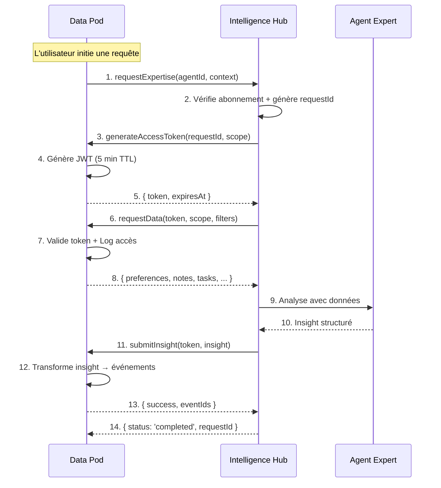

# Hub Protocol V1.0 - Spécification Technique

**Version :** 1.0  
**Statut :** Spécification Finale  
**Date :** 2025-01-20

---

## 1. Vue d'Ensemble

Le **Hub Protocol** est le contrat standardisé qui régit la communication entre le **Synap Core OS (Data Pod)** et le **Synap Intelligence Hub**. Ce protocole garantit :

- ✅ **Sécurité** : Authentification mutuelle et tokens à durée limitée
- ✅ **Type Safety** : Schémas Zod pour validation à l'exécution
- ✅ **Traçabilité** : Audit trail complet de tous les accès
- ✅ **Souveraineté** : Le Data Pod contrôle totalement l'accès à ses données

---

## 2. Architecture du Protocole

### 2.1. Flux de Communication



### 2.2. Principes Fondamentaux

1. **Le Data Pod est toujours l'initiateur** : Le Hub ne peut jamais initier une connexion
2. **Tokens à durée limitée** : Maximum 5 minutes de validité
3. **Scope-based access** : Le Hub ne peut demander que les données autorisées
4. **Audit trail complet** : Chaque accès est enregistré dans le Data Pod

---

## 3. Router tRPC `hub.*`

### 3.1. Structure du Router

**Fichier :** `packages/api/src/routers/hub.ts`

```typescript
import { router, protectedProcedure } from '../trpc.js';
import { z } from 'zod';
import { createLogger } from '@synap/core';
import { 
  generateHubAccessToken, 
  validateHubToken,
  transformInsightToEvents 
} from './hub-utils.js';
import { getEventRepository } from '@synap/database';

const logger = createLogger({ module: 'hub-router' });

export const hubRouter = router({
  // ... endpoints définis ci-dessous
});
```

### 3.2. Endpoint : `generateAccessToken`

**Objectif :** Générer un token d'accès temporaire pour le Hub

**Signature :**
```typescript
generateAccessToken: protectedProcedure
  .input(z.object({
    requestId: z.string().uuid(),
    scope: z.array(z.enum([
      'preferences',
      'calendar',
      'notes',
      'tasks',
      'projects',
      'conversations',
      'entities',
      'relations',
      'knowledge_facts'
    ])),
    expiresIn: z.number().int().min(60).max(300).default(300), // 1-5 minutes
  }))
  .mutation(async ({ ctx, input }) => {
    // Implémentation ci-dessous
  })
```

**Comportement :**
1. Vérifie que l'utilisateur est authentifié
2. Génère un JWT avec les informations suivantes :
   - `userId` : ID de l'utilisateur
   - `scope` : Liste des permissions
   - `requestId` : ID de la requête Hub
   - `exp` : Timestamp d'expiration
3. Enregistre la génération du token dans l'audit log
4. Retourne le token et la date d'expiration

**Réponse :**
```typescript
{
  token: string; // JWT token
  expiresAt: number; // Timestamp Unix (milliseconds)
  requestId: string; // UUID de la requête
}
```

**Exemple d'utilisation :**
```typescript
// Appelé par le Hub après avoir reçu une requête d'expertise
const { token, expiresAt } = await hubClient.generateAccessToken.mutate({
  requestId: 'req-123',
  scope: ['preferences', 'calendar', 'tasks'],
  expiresIn: 300, // 5 minutes
});
```

---

### 3.3. Endpoint : `requestData`

**Objectif :** Permettre au Hub de demander des données en lecture seule

**Signature :**
```typescript
requestData: publicProcedure
  .input(z.object({
    token: z.string().min(1), // JWT token
    scope: z.array(z.enum([
      'preferences',
      'calendar',
      'notes',
      'tasks',
      'projects',
      'conversations',
      'entities',
      'relations',
      'knowledge_facts'
    ])),
    filters: z.object({
      // Filtres optionnels selon le scope
      dateRange: z.object({
        start: z.string().datetime(),
        end: z.string().datetime(),
      }).optional(),
      entityTypes: z.array(z.string()).optional(),
      limit: z.number().int().min(1).max(1000).default(100),
      offset: z.number().int().nonnegative().default(0),
    }).optional(),
  }))
  .query(async ({ ctx, input }) => {
    // Implémentation ci-dessous
  })
```

**Comportement :**
1. Valide le JWT token (vérifie signature, expiration, scope)
2. Extrait le `userId` et le `requestId` du token
3. Vérifie que le token n'a pas été révoqué
4. Récupère les données selon le scope demandé
5. Enregistre l'accès dans l'audit log
6. Retourne les données en format read-only

**Réponse :**
```typescript
{
  userId: string;
  requestId: string;
  data: {
    preferences?: UserPreferences;
    calendar?: CalendarEvent[];
    notes?: NoteSummary[];
    tasks?: TaskSummary[];
    projects?: ProjectSummary[];
    conversations?: ConversationSummary[];
    entities?: EntitySummary[];
    relations?: RelationSummary[];
    knowledge_facts?: KnowledgeFact[];
  };
  metadata: {
    retrievedAt: string; // ISO timestamp
    scope: string[];
    recordCount: number;
  };
}
```

**Exemple d'utilisation :**
```typescript
// Appelé par le Hub avec le token reçu
const data = await hubClient.requestData.query({
  token: 'eyJhbGciOiJIUzI1NiIsInR5cCI6IkpXVCJ9...',
  scope: ['preferences', 'calendar'],
  filters: {
    dateRange: {
      start: '2025-05-01T00:00:00Z',
      end: '2025-05-31T23:59:59Z',
    },
  },
});
```

---

### 3.4. Endpoint : `submitInsight`

**Objectif :** Permettre au Hub de soumettre un insight structuré qui sera transformé en événements

**Signature :**
```typescript
submitInsight: publicProcedure
  .input(z.object({
    token: z.string().min(1), // JWT token
    insight: HubInsightSchema, // Schéma défini ci-dessous
  }))
  .mutation(async ({ ctx, input }) => {
    // Implémentation ci-dessous
  })
```

**Comportement :**
1. Valide le JWT token
2. Valide le schéma de l'insight
3. Transforme l'insight en événements SynapEvent
4. Publie les événements dans l'Event Store
5. Enregistre la soumission dans l'audit log
6. Retourne les IDs des événements créés

**Réponse :**
```typescript
{
  success: boolean;
  requestId: string;
  eventIds: string[]; // UUIDs des événements créés
  eventsCreated: number;
  errors?: Array<{
    actionIndex: number;
    error: string;
  }>;
}
```

**Exemple d'utilisation :**
```typescript
// Appelé par le Hub après avoir généré un insight
const result = await hubClient.submitInsight.mutate({
  token: 'eyJhbGciOiJIUzI1NiIsInR5cCI6IkpXVCJ9...',
  insight: {
    version: '1.0',
    type: 'action_plan',
    correlationId: 'req-123',
    actions: [
      {
        eventType: 'project.creation.requested',
        data: {
          title: 'Voyage à Lisbonne',
          description: 'Planification du voyage en mai',
        },
        requiresConfirmation: false,
      },
      {
        eventType: 'task.creation.requested',
        data: {
          title: 'Réserver vol',
          dueDate: '2025-04-15',
        },
        requiresConfirmation: true,
      },
    ],
    confidence: 0.95,
    reasoning: 'Basé sur les préférences de voyage et le calendrier',
  },
});
```

---

## 4. Schémas Zod pour les Insights

### 4.1. Schéma Principal : `HubInsightSchema`

**Fichier :** `packages/hub-protocol/src/schemas.ts` (nouveau package à créer)

```typescript
import { z } from 'zod';

/**
 * Hub Insight Schema V1.0
 * 
 * Format standardisé pour les insights retournés par le Hub.
 * Ce schéma garantit la transformation fiable en événements.
 */
export const HubInsightSchema = z.object({
  // Version du schéma (pour migration future)
  version: z.literal('1.0'),
  
  // Type d'insight
  type: z.enum([
    'action_plan',    // Plan d'action avec événements à créer
    'suggestion',     // Suggestion à présenter à l'utilisateur
    'analysis',       // Analyse sans action immédiate
    'automation',     // Automatisation à exécuter
  ]),
  
  // ID de corrélation (lien avec la requête initiale)
  correlationId: z.string().uuid(),
  
  // Actions à exécuter (pour type: 'action_plan' ou 'automation')
  actions: z.array(ActionSchema).optional(),
  
  // Analyse textuelle (pour type: 'analysis' ou 'suggestion')
  analysis: AnalysisSchema.optional(),
  
  // Niveau de confiance (0.0 à 1.0)
  confidence: z.number().min(0).max(1),
  
  // Raisonnement de l'agent (optionnel)
  reasoning: z.string().optional(),
  
  // Métadonnées additionnelles
  metadata: z.record(z.unknown()).optional(),
});

export type HubInsight = z.infer<typeof HubInsightSchema>;
```

### 4.2. Schéma : `ActionSchema`

```typescript
/**
 * Action Schema
 * 
 * Représente une action à transformer en événement.
 */
export const ActionSchema = z.object({
  // Type d'événement à créer (doit correspondre à EventTypes)
  eventType: z.string().min(1),
  
  // ID d'agrégat (optionnel, pour lier à une entité existante)
  aggregateId: z.string().uuid().optional(),
  
  // Données de l'événement (doit correspondre au schéma de l'eventType)
  data: z.record(z.unknown()),
  
  // Si true, l'action nécessite une confirmation utilisateur avant exécution
  requiresConfirmation: z.boolean().default(false),
  
  // Priorité (optionnel, pour ordre d'exécution)
  priority: z.number().int().min(0).max(100).optional(),
  
  // Métadonnées spécifiques à l'action
  metadata: z.record(z.unknown()).optional(),
});

export type Action = z.infer<typeof ActionSchema>;
```

### 4.3. Schéma : `AnalysisSchema`

```typescript
/**
 * Analysis Schema
 * 
 * Pour les insights de type 'analysis' ou 'suggestion'.
 */
export const AnalysisSchema = z.object({
  // Titre de l'analyse
  title: z.string().min(1),
  
  // Contenu de l'analyse (markdown supporté)
  content: z.string().min(1),
  
  // Points clés (bullet points)
  keyPoints: z.array(z.string()).optional(),
  
  // Recommandations (optionnel)
  recommendations: z.array(z.string()).optional(),
  
  // Sources ou références (optionnel)
  sources: z.array(z.object({
    type: z.enum(['note', 'task', 'project', 'conversation', 'external']),
    id: z.string().optional(),
    title: z.string().optional(),
    url: z.string().url().optional(),
  })).optional(),
  
  // Tags pour catégorisation
  tags: z.array(z.string()).optional(),
});

export type Analysis = z.infer<typeof AnalysisSchema>;
```

---

## 5. Transformation Insights → Événements

### 5.1. Fonction : `transformInsightToEvents`

**Fichier :** `packages/api/src/routers/hub-utils.ts`

```typescript
import type { HubInsight, Action } from '@synap/hub-protocol';
import { createSynapEvent, type EventType } from '@synap/types';
import { isValidEventType } from '@synap/types';
import { ValidationError } from '@synap/core';

/**
 * Transforme un HubInsight en événements SynapEvent
 * 
 * @param insight - L'insight à transformer
 * @param userId - ID de l'utilisateur
 * @param requestId - ID de la requête (pour corrélation)
 * @returns Tableau d'événements SynapEvent
 */
export function transformInsightToEvents(
  insight: HubInsight,
  userId: string,
  requestId: string
): Array<ReturnType<typeof createSynapEvent>> {
  const events: Array<ReturnType<typeof createSynapEvent>> = [];
  
  // Vérifier que le type d'insight est supporté
  if (insight.type !== 'action_plan' && insight.type !== 'automation') {
    throw new ValidationError(
      `Insight type '${insight.type}' cannot be transformed into events. Only 'action_plan' and 'automation' are supported.`,
      { insightType: insight.type }
    );
  }
  
  // Si pas d'actions, retourner un tableau vide
  if (!insight.actions || insight.actions.length === 0) {
    return events;
  }
  
  // Transformer chaque action en événement
  for (const [index, action] of insight.actions.entries()) {
    // Valider que le type d'événement est valide
    if (!isValidEventType(action.eventType)) {
      throw new ValidationError(
        `Invalid event type: '${action.eventType}'. Action index: ${index}`,
        { eventType: action.eventType, actionIndex: index }
      );
    }
    
    // Créer l'événement
    const event = createSynapEvent({
      type: action.eventType as EventType,
      data: action.data,
      userId,
      aggregateId: action.aggregateId,
      source: 'automation', // Les insights du Hub sont considérés comme des automatisations
      correlationId: insight.correlationId,
      requestId,
      metadata: {
        ...action.metadata,
        requiresConfirmation: action.requiresConfirmation,
        priority: action.priority,
        hubInsightType: insight.type,
        hubConfidence: insight.confidence,
      },
    });
    
    events.push(event);
  }
  
  return events;
}
```

---

## 6. Authentification et Sécurité

### 6.1. Génération de Tokens JWT

**Fichier :** `packages/api/src/routers/hub-utils.ts`

```typescript
import jwt from 'jsonwebtoken';
import { randomUUID } from 'crypto';

const HUB_JWT_SECRET = process.env.HUB_JWT_SECRET || 'change-me-in-production';

export interface HubTokenPayload {
  userId: string;
  requestId: string;
  scope: string[];
  iat: number;
  exp: number;
}

/**
 * Génère un token JWT pour le Hub
 * 
 * @param userId - ID de l'utilisateur
 * @param requestId - ID de la requête Hub
 * @param scope - Liste des permissions
 * @param expiresIn - Durée de validité en secondes (60-300)
 * @returns Token JWT et date d'expiration
 */
export function generateHubAccessToken(
  userId: string,
  requestId: string,
  scope: string[],
  expiresIn: number = 300
): { token: string; expiresAt: number } {
  // Clamp expiresIn entre 60 et 300 secondes
  const validExpiresIn = Math.max(60, Math.min(300, expiresIn));
  
  const now = Math.floor(Date.now() / 1000);
  const exp = now + validExpiresIn;
  
  const payload: HubTokenPayload = {
    userId,
    requestId,
    scope,
    iat: now,
    exp,
  };
  
  const token = jwt.sign(payload, HUB_JWT_SECRET, {
    algorithm: 'HS256',
    expiresIn: validExpiresIn,
  });
  
  return {
    token,
    expiresAt: exp * 1000, // Retourner en millisecondes
  };
}

/**
 * Valide un token JWT du Hub
 * 
 * @param token - Token JWT à valider
 * @returns Payload décodé ou null si invalide
 */
export function validateHubToken(token: string): HubTokenPayload | null {
  try {
    const decoded = jwt.verify(token, HUB_JWT_SECRET, {
      algorithms: ['HS256'],
    }) as HubTokenPayload;
    
    // Vérifier que le token n'a pas expiré
    const now = Math.floor(Date.now() / 1000);
    if (decoded.exp < now) {
      return null;
    }
    
    return decoded;
  } catch (error) {
    return null;
  }
}
```

### 6.2. Audit Logging

**Fichier :** `packages/api/src/routers/hub-utils.ts`

```typescript
import { getEventRepository } from '@synap/database';
import { createSynapEvent, EventTypes } from '@synap/types';

/**
 * Enregistre un accès Hub dans l'audit log
 */
export async function logHubAccess(
  userId: string,
  requestId: string,
  action: 'token.generated' | 'data.requested' | 'insight.submitted',
  metadata?: Record<string, unknown>
): Promise<void> {
  const eventRepo = getEventRepository();
  
  const auditEvent = createSynapEvent({
    type: 'hub.access.logged' as EventType, // Nouveau type d'événement à ajouter
    data: {
      action,
      requestId,
      ...metadata,
    },
    userId,
    source: 'system',
    correlationId: requestId,
  });
  
  await eventRepo.append(auditEvent);
}
```

---

## 7. Gestion des Erreurs

### 7.1. Codes d'Erreur Standardisés

```typescript
export enum HubErrorCode {
  // Authentification
  INVALID_TOKEN = 'HUB_INVALID_TOKEN',
  EXPIRED_TOKEN = 'HUB_EXPIRED_TOKEN',
  INSUFFICIENT_SCOPE = 'HUB_INSUFFICIENT_SCOPE',
  
  // Validation
  INVALID_INSIGHT = 'HUB_INVALID_INSIGHT',
  INVALID_ACTION = 'HUB_INVALID_ACTION',
  INVALID_EVENT_TYPE = 'HUB_INVALID_EVENT_TYPE',
  
  // Données
  DATA_NOT_FOUND = 'HUB_DATA_NOT_FOUND',
  SCOPE_NOT_ALLOWED = 'HUB_SCOPE_NOT_ALLOWED',
  
  // Système
  RATE_LIMIT_EXCEEDED = 'HUB_RATE_LIMIT_EXCEEDED',
  INTERNAL_ERROR = 'HUB_INTERNAL_ERROR',
}
```

### 7.2. Format de Réponse d'Erreur

```typescript
{
  error: {
    code: HubErrorCode;
    message: string;
    details?: Record<string, unknown>;
    timestamp: string; // ISO timestamp
  }
}
```

---

## 8. Exemple d'Implémentation Complète

### 8.1. Router Complet

Voir le fichier `packages/api/src/routers/hub.ts` pour l'implémentation complète avec tous les endpoints.

### 8.2. Client Hub (Côté Intelligence Hub)

```typescript
// Dans le Hub, créer un client tRPC pour communiquer avec les Data Pods
import { createTRPCProxyClient, httpBatchLink } from '@trpc/client';
import type { AppRouter } from '@synap/api';

const hubClient = createTRPCProxyClient<AppRouter>({
  links: [
    httpBatchLink({
      url: `${dataPodUrl}/trpc`,
      headers: {
        'Authorization': `Bearer ${hubApiKey}`, // API key du Hub
      },
    }),
  ],
});

// Utilisation
const token = await hubClient.hub.generateAccessToken.mutate({
  requestId: 'req-123',
  scope: ['preferences', 'calendar'],
});

const data = await hubClient.hub.requestData.query({
  token: token.token,
  scope: ['preferences', 'calendar'],
});

const result = await hubClient.hub.submitInsight.mutate({
  token: token.token,
  insight: { /* ... */ },
});
```

---

## 9. Versioning et Évolution

### 9.1. Politique de Versioning

- **Version majeure** : Changements incompatibles (ex: V1 → V2)
- **Version mineure** : Nouvelles fonctionnalités rétrocompatibles (ex: V1.0 → V1.1)
- **Version patch** : Corrections de bugs (ex: V1.0.0 → V1.0.1)

### 9.2. Migration

Lors d'un changement de version :
1. Le Hub annonce sa version supportée dans les headers
2. Le Data Pod vérifie la compatibilité
3. Si incompatible, retourne une erreur avec la version minimale requise

---

## 10. Tests et Validation

### 10.1. Tests Unitaires

- Validation des schémas Zod
- Transformation insights → événements
- Génération et validation de tokens JWT

### 10.2. Tests d'Intégration

- Flux complet Data Pod → Hub → Data Pod
- Gestion des erreurs
- Audit logging

---

## Conclusion

Ce protocole garantit une communication sécurisée, type-safe et traçable entre le Data Pod et l'Intelligence Hub. Il résout tous les problèmes identifiés dans l'audit stratégique :

✅ **Contrat d'API standardisé**  
✅ **Authentification mutuelle avec tokens temporaires**  
✅ **Format structuré pour les insights**  
✅ **Audit trail complet**  
✅ **Transformation automatique insights → événements**

---

**Prochaine étape :** Implémenter ce protocole dans le Core OS et créer le package `@synap/hub-protocol`.

