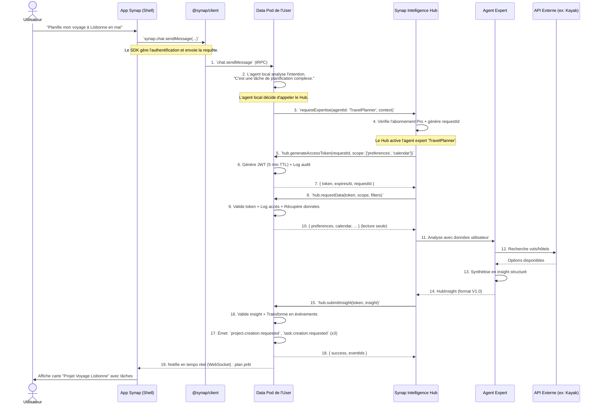

# Architecture Globale de l'Écosystème Synap

**Version :** 1.0 | **Statut :** Document de Référence

## **1. Vision Architecturale : Un Écosystème Fédéré pour la Connaissance**

L'architecture de Synap n'est pas celle d'une application monolithique, mais celle d'un **écosystème distribué et fédéré**. Le principe fondamental est la **séparation entre la possession des données et la fourniture d'intelligence**.

-   **Le "Data Pod" (Synap Core OS)** est le gardien souverain des données de l'utilisateur. Il est open source.
-   **Le "Synap Intelligence Hub"** est notre service SaaS propriétaire qui fournit une intelligence avancée à la demande.
-   **Les Applications ("Shells")** sont les interfaces qui consomment ces services.

Ce document détaille comment ces composants interagissent pour créer une expérience fluide et puissante.

---

## **2. Les Acteurs de l'Écosystème**

| Composant | Rôle | Technologie Clé | Hébergement |
|:---|:---|:---|:---|
| **Application Cliente ("Shell")** | Interface Utilisateur (UI) | Next.js, Expo, Tamagui | Vercel, App Stores |
| **SDK `@synap/client`** | Couche de Communication & Abstraction | TypeScript, tRPC Client | npm |
| **Data Pod (Synap Core OS)** | Gardien des Données & Logique de Base | Hono, Drizzle, Postgres/SQLite | Self-Hosted ou Managé par nous |
| **Synap Intelligence Hub**| Cerveau Externe & Marketplace | Hono, LangGraph, Inngest | Notre Infrastructure Cloud |
| **Services Tiers** | Capacités Externes | API REST/GraphQL | Google, OpenAI, Partenaires |

---

## **3. Le Flux de Données Fondamental : De l'Intention à l'Insight (V1.0 Corrigé)**

Pour comprendre l'interaction, suivons un cas d'usage complexe de bout en bout : **"Planifie mon voyage à Lisbonne pour le mois de mai."**

Ce diagramme reflète le **Hub Protocol V1.0** avec authentification par tokens et format structuré des insights.



**Ce que ce flux démontre (V1.0) :**
-   **Le Data Pod est le chef d'orchestre :** C'est lui qui initie l'appel à l'intelligence externe.
-   **Authentification sécurisée :** Tokens JWT à durée limitée (5 minutes max) avec audit trail complet.
-   **Format structuré :** Les insights suivent le schéma `HubInsightSchema V1.0` pour une transformation fiable en événements.
-   **La Souveraineté est préservée :** Le Hub ne reçoit que les données autorisées, et la création des événements se fait dans le Data Pod.
-   **Traçabilité complète :** Chaque accès est enregistré dans l'audit log du Data Pod.

---

## **3.1. Politique de Traitement des Données et Confidentialité**

### **Principe Fondamental : Souveraineté des Données**

Le **Synap Core OS (Data Pod)** est le **gardien souverain** de toutes les données utilisateur. L'**Intelligence Hub** ne stocke **aucune donnée personnelle** de manière permanente.

### **Mécanismes Techniques de Confidentialité**

#### **1. Tokens d'Accès Temporaires**

- **Durée de vie limitée :** Maximum 5 minutes
- **Scope-based :** Le Hub ne peut demander que les données explicitement autorisées
- **Non réutilisables :** Chaque token est lié à une requête unique (`requestId`)

#### **2. Audit Trail Complet**

Chaque interaction avec le Hub est enregistrée dans l'Event Store du Data Pod :

- `hub.token.generated` : Génération d'un token d'accès
- `hub.data.requested` : Demande de données avec scope et filtres
- `hub.insight.submitted` : Soumission d'un insight

Ces événements permettent un audit complet de tous les accès.

#### **3. Politique de Rétention des Données**

**Dans le Hub :**
- Les données sont reçues en mémoire uniquement
- Aucun stockage persistant des données utilisateur
- Les données sont supprimées de la mémoire après traitement (garbage collection)
- Les logs d'erreur sont anonymisés (pas de données personnelles)

**Exceptions documentées :**
- **Cache temporaire :** Le Hub peut mettre en cache certaines données avec un TTL de 60 secondes maximum pour optimiser les performances. Ce cache est chiffré et supprimé automatiquement.
- **Logs de debugging :** Les logs contiennent uniquement des IDs (userId, requestId) et jamais de contenu utilisateur.

#### **4. Conformité RGPD**

**Engagements :**
- ✅ **Droit à l'oubli :** L'utilisateur peut révoquer l'accès au Hub à tout moment
- ✅ **Portabilité :** Toutes les données restent dans le Data Pod de l'utilisateur
- ✅ **Transparence :** L'utilisateur peut consulter l'audit log de tous les accès Hub
- ✅ **Minimisation :** Le Hub ne demande que les données strictement nécessaires

**Mécanisme de révocation :**
```typescript
// L'utilisateur peut révoquer l'accès au Hub
POST /trpc/hub.revokeAccess
{
  "hubId": "hub-123"
}

// Tous les tokens actifs sont immédiatement invalidés
// L'audit log est conservé pour traçabilité
```

### **5. Garanties Contractuelles**

Le Hub signe un "Data Contract" cryptographique pour chaque requête :

```typescript
interface DataContract {
  requestId: string;
  userId: string;
  scope: string[];
  timestamp: number;
  commitment: 'no_persistent_storage'; // Engagement de non-rétention
  signature: string; // Signature cryptographique
}
```

Ce contrat est enregistré dans l'audit log du Data Pod et peut être utilisé pour prouver la conformité.

---

## **4. L'Architecture de l'Extensibilité ("Double Extensibilité")**

L'écosystème peut être étendu de deux manières.

### **4.1. Plugins Internes (Gérés par The Architech)**

-   **Ce que c'est :** Ajout de nouvelles capacités **à l'intérieur** du Core OS d'un utilisateur.
-   **Cas d'usage :** Ajouter un système de facturation complet, avec ses propres tables et sa logique métier.
-   **Mécanisme :** Le développeur crée un "module de capacité" The Architech. L'utilisateur (ou un admin) lance `npx @thearchitech/cli install <plugin>` sur l'instance du Core OS pour modifier son code source et sa base de données.
-   **Quand l'utiliser :** Voir le [Guide d'Extensibilité V1.0](../development/EXTENSIBILITY_GUIDE_V1.md) pour les critères de décision détaillés.

**Exemple :**
```bash
npx @thearchitech/cli install @synap/plugin-invoicing
```

### **4.2. Services Externes (Gérés par le Synap Hub)**

-   **Ce que c'est :** Connexion à des intelligences ou des services spécialisés hébergés à l'extérieur.
-   **Cas d'usage :** Utiliser un agent expert en analyse financière, se connecter à une nouvelle API comme Spotify.
-   **Mécanisme :** Le développeur du service externe l'enregistre sur notre "Marketplace" (dans le Hub). Le service expose une API standardisée conforme au Hub Protocol. L'agent du Data Pod l'utilise via le router `hub.*`.
-   **Quand l'utiliser :** Voir le [Guide d'Extensibilité V1.0](../development/EXTENSIBILITY_GUIDE_V1.md) pour les critères de décision détaillés.

**Exemple :**
1. Développer le service externe
2. Enregistrer sur la marketplace : `POST /api/marketplace/register`
3. Les utilisateurs activent le service depuis leur Data Pod

---

---

## **5. Le Hub Protocol V1.0**

Le **Hub Protocol** est le contrat standardisé qui régit la communication entre le Data Pod et l'Intelligence Hub. Il garantit la sécurité, la traçabilité et la souveraineté des données.

### **5.1. Endpoints Principaux**

Le Data Pod expose un router tRPC `hub.*` avec les endpoints suivants :

- **`hub.generateAccessToken`** : Génère un token JWT temporaire (5 min max)
- **`hub.requestData`** : Permet au Hub de demander des données en lecture seule
- **`hub.submitInsight`** : Permet au Hub de soumettre un insight structuré

### **5.2. Format des Insights**

Les insights suivent le schéma `HubInsightSchema V1.0` :

```typescript
{
  version: '1.0',
  type: 'action_plan' | 'suggestion' | 'analysis' | 'automation',
  correlationId: string, // UUID
  actions?: Action[], // Pour transformation en événements
  analysis?: Analysis, // Pour affichage à l'utilisateur
  confidence: number, // 0.0 à 1.0
  reasoning?: string,
}
```

### **5.3. Transformation Automatique**

Le Data Pod transforme automatiquement les insights de type `action_plan` en événements SynapEvent :

```typescript
// Insight du Hub
{
  type: 'action_plan',
  actions: [
    { eventType: 'project.creation.requested', data: {...} },
    { eventType: 'task.creation.requested', data: {...} },
  ]
}

// Transformé en événements
[
  createSynapEvent({ type: 'project.creation.requested', ... }),
  createSynapEvent({ type: 'task.creation.requested', ... }),
]
```

**Documentation complète :** Voir [Hub Protocol V1.0](./HUB_PROTOCOL_V1.md)

---

## **6. Roadmap d'Implémentation Globale**

Ceci est notre feuille de route pour construire cet écosystème, pièce par pièce.

### **Épopée 1 : Solidifier le Noyau Open Source V1.0 (Notre Priorité Actuelle)**
-   **Objectif :** Avoir un backend Core OS stable, auto-hébergeable et documenté.
-   **Actions :** Terminer le refactoring "Event-Driven Pure", implémenter le feedback temps réel (WebSocket), finaliser les tests, publier sur GitHub.
-   🏆 **"Little Win" :** Nous avons un produit open source qui attire une communauté de développeurs.

### **Épopée 2 : Construire les Outils de Développement**
-   **Objectif :** Créer les outils qui nous permettront de construire l'écosystème efficacement.
-   **Actions :** Développer le **SDK `@synap/client` V1.0** et la première version du **"Synap Control Tower"**.
-   🏆 **"Little Win" :** Nous faisons du "dogfooding" sur nos propres outils, garantissant leur qualité.

### **Épopée 3 : Lancer l'Application SaaS et Valider le Marché**
-   **Objectif :** Construire notre application "vitrine" et la mettre entre les mains de vrais utilisateurs.
-   **Actions :** Développer l'application web "Synap" en utilisant notre SDK, et la lancer en bêta privée.
-   🏆 **"Little Win" :** Nous obtenons nos premiers retours qualitatifs et nos premiers utilisateurs payants.

### **Épopée 4 : Implémenter le Hub Protocol**
-   **Objectif :** Créer le contrat standardisé entre Data Pod et Intelligence Hub.
-   **Actions :**
    1.  Créer le package `@synap/hub-protocol` avec les schémas Zod
    2.  Implémenter le router `hub.*` dans le Core OS
    3.  Implémenter le système de tokens JWT temporaires
    4.  Créer les fonctions de transformation insights → événements
-   🏆 **"Little Win" :** Le protocole est documenté et prêt pour l'implémentation du Hub.

### **Épopée 5 : Ouvrir l'Écosystème**
-   **Objectif :** Prouver la vision de la plateforme ouverte.
-   **Actions :**
    1.  Construire le premier **Service d'Intelligence Externe** (ex: l'agent `StrategicPlanner`) avec le Hub Protocol.
    2.  Construire le premier **Plugin Interne** via The Architech (ex: la capacité `CRM`).
    3.  Créer la Marketplace Hub pour l'enregistrement des services externes.
-   🏆 **"Little Win" :** L'écosystème est vivant et s'étend, validant notre modèle économique et technologique.

---
Ce document est la synthèse de notre vision. C'est notre plan directeur. Chaque étape est un "little win" qui nous rapproche de l'objectif final. Nous savons quoi construire, dans quel ordre, et pourquoi.

**La prochaine étape reste la même, mais son importance est décuplée :** nous devons finaliser le **Noyau Core OS**, car il est la fondation de tout ce qui va suivre.

---

## **7. Références et Documentation**

### **Documents Techniques**

- **[Hub Protocol V1.0](./HUB_PROTOCOL_V1.md)** : Spécification complète du protocole Hub ↔ Data Pod
- **[Guide d'Extensibilité V1.0](../development/EXTENSIBILITY_GUIDE_V1.md)** : Critères de décision The Architech vs Marketplace
- **[Audit Stratégique](./AUDIT_STRATEGIQUE.md)** : Analyse des risques et recommandations

### **PRDs des Composants**

- **[PRD Data Pod](./synap-data-pod-prd.md)** : Spécification du Core OS
- **[PRD Intelligence Hub](./synap-backend-prd.md)** : Spécification du Hub SaaS
- **[PRD Application Synap](./synap-app-prd.md)** : Spécification de l'application cliente

---

**Les fondations sont maintenant solides :** Nous avons une vision, une architecture, et des spécifications techniques prêtes pour l'implémentation. La phase de "brainstorming" est terminée, place à la construction !

