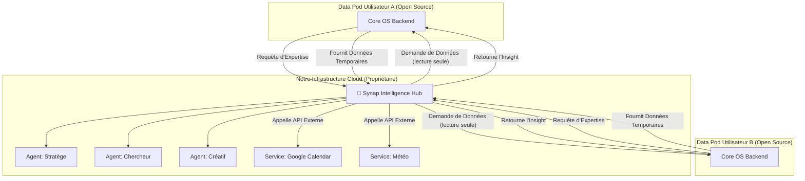

# **Document 2 : PRD du Backend Propriétaire "Synap Intelligence Hub"**

**Version :** 1.0 | **Statut :** Spécification Architecturale

## **1. Vision & Rôle dans l'Écosystème**

### **1.1. Rôle du "Synap Intelligence Hub"**
Le "Synap Intelligence Hub" est un **service SaaS propriétaire et multi-tenant** qui agit comme un **cerveau externe à la demande** pour les "Data Pods" des utilisateurs. Il ne stocke **aucune donnée personnelle** de l'utilisateur. Sa seule fonction est de recevoir des données contextuelles, d'exécuter des processus d'IA complexes, et de retourner des "insights" ou des plans d'action.

C'est notre **produit payant**. Les utilisateurs s'abonnent pour donner à leur Data Pod personnel l'accès à nos agents IA de classe mondiale.

### **1.2. Proposition de Valeur**
-   **Pour l'Utilisateur :** "Augmentez votre Data Pod avec une suite d'agents experts (stratège, chercheur, créatif...) capables d'analyses profondes, de suggestions proactives et d'automatisations complexes."
-   **Pour l'Écosystème :** "Nous fournissons l'infrastructure d'IA et les modèles d'agents les plus avancés, permettant aux développeurs tiers de se concentrer sur la création d'expériences, sans avoir à gérer la complexité des LLM."

---

## **2. Architecture Générale : Le "Hub & Spoke" de l'Intelligence**

Notre Intelligence Hub fonctionne comme un "hub" central qui se connecte aux "rayons" (les Data Pods des utilisateurs).



**Le flux est toujours initié par le Data Pod de l'utilisateur, préservant ainsi sa souveraineté.**

### **2.1. Le Hub Protocol V1.0**

La communication entre le Hub et les Data Pods suit le **Hub Protocol V1.0**, un contrat standardisé qui garantit :

- ✅ **Sécurité** : Authentification mutuelle via tokens JWT temporaires (5 minutes max)
- ✅ **Type Safety** : Schémas Zod pour validation à l'exécution
- ✅ **Traçabilité** : Audit trail complet de tous les accès
- ✅ **Souveraineté** : Le Data Pod contrôle totalement l'accès à ses données

**Flux détaillé :**

1. **Data Pod → Hub** : `requestExpertise(agentId, context)`
2. **Hub → Data Pod** : `hub.generateAccessToken(requestId, scope)` → Retourne JWT
3. **Hub → Data Pod** : `hub.requestData(token, scope, filters)` → Retourne données en lecture seule
4. **Hub traite** : Agent expert analyse les données
5. **Hub → Data Pod** : `hub.submitInsight(token, insight)` → Insight structuré conforme au schéma V1.0
6. **Data Pod transforme** : Insight → Événements SynapEvent automatiquement

**Format des Insights :**

Les insights retournés par le Hub suivent le schéma `HubInsightSchema V1.0` :

```typescript
{
  version: '1.0',
  type: 'action_plan' | 'suggestion' | 'analysis' | 'automation',
  correlationId: string, // UUID de la requête
  actions?: Action[], // Pour transformation en événements
  analysis?: Analysis, // Pour affichage à l'utilisateur
  confidence: number, // 0.0 à 1.0
  reasoning?: string,
}
```

**Documentation complète :** Voir [Hub Protocol V1.0](./HUB_PROTOCOL_V1.md)

---

## **3. Capacités Fondamentales & Technologies**

L'Intelligence Hub est construit autour de notre "Cerveau en 3 Systèmes".

### **3.1. Le "Néocortex" : Orchestration d'Agents avec LangGraph**
-   **Technologie :** **LangGraph.js**.
-   **Rôle :** C'est le cœur de notre service. Nous maintenons une bibliothèque de **graphes d'agents "experts"** pré-entraînés et optimisés.
-   **Exemples d'Agents Propriétaires :**
    -   **Agent `StrategicPlanner` :** Prend une idée brute et la transforme en un plan de projet complet, avec des tâches, des jalons et des risques identifiés.
    -   **Agent `ResearchSynthesizer` :** Prend une liste de notes et de sources, et rédige un rapport de synthèse avec des arguments, des contre-arguments et des conclusions.
    -   **Agent `CreativeWriter` :** Prend un concept et peut générer des drafts d'articles de blog, des scripts de vidéo, ou des posts pour les réseaux sociaux.
-   **Fonctionnement :** L'agent local du Data Pod de l'utilisateur (l'agent "généraliste") identifie qu'une tâche nécessite une expertise. Il appelle alors notre Hub, qui route la demande vers le bon agent expert.

### **3.2. La "Super Memory" Avancée**
-   **Rôle :** Bien que les "faits" soient stockés dans le Data Pod de l'utilisateur, notre Intelligence Hub fournit les **agents spécialisés dans l'extraction et l'utilisation** de cette mémoire.
-   **Technologie :** Des modèles de langage fine-tunés pour la reconnaissance d'entités et l'extraction de relations.
-   **Capacités :**
    -   **Extraction de Faits :** Nos agents sont experts pour lire une conversation et en extraire des faits pertinents à stocker dans la table `knowledge_facts` de l'utilisateur.
    -   **Inférence de Préférences :** Nos agents peuvent analyser la "Super Memory" pour en déduire des préférences implicites (ex: "L'utilisateur a tendance à repousser les tâches administratives au vendredi après-midi.").

### **3.3. Le "Cerveau Profond" : Le Moteur de Proactivité (Insight Engine)**
-   **Rôle :** C'est la capacité la plus "premium". Nos `workers` tournent sur notre infrastructure cloud et analysent les patterns de manière beaucoup plus poussée que les workers de base du Core OS.
-   **Technologie :** **Inngest** + modèles de Machine Learning custom (au-delà des LLM).
-   **Capacités :**
    -   **Analyse Prédictive :** "Basé sur ton rythme actuel, le projet 'Alpha' a 80% de chances d'être en retard. Je te suggère de déléguer ces deux tâches."
    -   **Découverte de "Clusters" Sémantiques :** "J'ai remarqué que tes notes sur 'l'IA', la 'philosophie stoïcienne' et 'le design de jeux vidéo' partagent des concepts sous-jacents. Il y a peut-être un sujet d'essai unique à explorer ici."
    -   **Génération de "Quêtes" :** "Ton objectif est 'Lancer mon SaaS'. Je t'ai préparé un plan d'action en 10 étapes basé sur tes notes et les meilleures pratiques."

### **3.4. Le Hub d'Intégrations Externes**
-   **Rôle :** Gérer la complexité des connexions aux API tierces.
-   **Technologie :** Des "adaptateurs" sécurisés pour chaque service externe.
-   **Fonctionnement :** L'utilisateur connecte son compte Google à **notre Hub SaaS** une seule fois. Ensuite, son Data Pod peut demander au Hub : "Ajoute cet événement à mon Google Calendar". Le Hub gère le token OAuth et fait l'appel à l'API de Google. C'est plus sécurisé et plus simple pour l'utilisateur.

### **3.5. La Marketplace de Services Externes**
-   **Rôle :** Permettre aux développeurs tiers d'enregistrer leurs services d'intelligence sur notre plateforme.
-   **Technologie :** API REST pour l'enregistrement + Hub Protocol pour la communication.
-   **Fonctionnement :** 
    1. Le développeur enregistre son service via `POST /api/marketplace/register`
    2. Le service expose une API conforme au Hub Protocol
    3. Les utilisateurs activent le service depuis leur Data Pod
    4. Le Hub route les requêtes vers le service externe
-   **Documentation :** Voir [Guide d'Extensibilité V1.0](../development/EXTENSIBILITY_GUIDE_V1.md)

---

## **4. Architecture Technique du Backend Propriétaire**

-   **Stack :** Identique à celle du Core OS (Hono, Drizzle, Neon, etc.) pour une cohérence maximale.
-   **API :** 
    - API interne sécurisée, appelée par les Data Pods des utilisateurs via le Hub Protocol
    - API REST pour l'enregistrement des services externes sur la marketplace
-   **Base de Données :** Notre backend propriétaire a sa **propre base de données**, mais elle ne contient **que** des données de service :
    -   `users` (une copie des ID utilisateurs pour la liaison).
    -   `subscriptions` (l'état des abonnements Stripe/RevenueCat).
    -   `api_keys` (les clés pour que les Data Pods puissent nous appeler).
    -   `usage_credits` (le suivi de la consommation de l'IA).
    -   `marketplace_services` (la liste des services externes disponibles).
    -   `hub_access_logs` (audit trail des accès Hub pour conformité).

**⚠️ Important :** Le Hub **ne stocke jamais** de données personnelles utilisateur de manière permanente. Les données sont reçues en mémoire uniquement et supprimées après traitement. Voir la [Politique de Confidentialité](./ecosysteme-prd.md#31-politique-de-traitement-des-données-et-confidentialité) pour plus de détails.

---

## **5. Roadmap d'Implémentation de l'Intelligence Hub**

### **V1 (MVP de l'Intelligence)**
-   **Objectif :** Offrir une première capacité propriétaire payante qui démontre la valeur du modèle.
-   **Features :**
    1.  **L'Agent `StrategicPlanner` :** Un premier agent expert capable de transformer une idée brute en un projet structuré avec des tâches.
    2.  **L'implémentation de la "Super Memory" :** Le worker qui extrait et sauvegarde les faits dans le Data Pod de l'utilisateur.
    3.  **Le système de paiement et de crédits :** L'intégration Stripe/RevenueCat et la logique pour décompter les appels à l'IA.

### **V2 (Écosystème d'Agents)**
-   **Objectif :** Étoffer notre offre d'intelligence et ouvrir la plateforme.
-   **Features :**
    1.  **Bibliothèque d'Agents :** Développement de 5 à 10 agents experts supplémentaires (Marketing, Finance, etc.).
    2.  **Moteur de Proactivité V1 :** Lancement du premier worker d'"Insight Engine" qui envoie des suggestions à l'"Inbox IA" de l'utilisateur.
    3.  **Marketplace de Services (Bêta) :** Permettre à un premier partenaire tiers de connecter son propre service d'intelligence à notre Hub via le Hub Protocol V1.0.
    4.  **Hub Protocol V1.0 :** Implémentation complète du protocole standardisé pour la communication Hub ↔ Data Pod.

